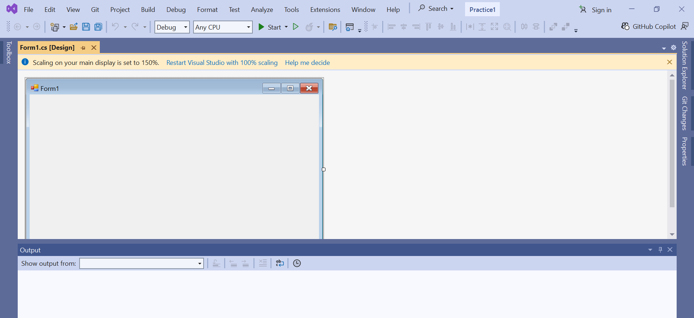
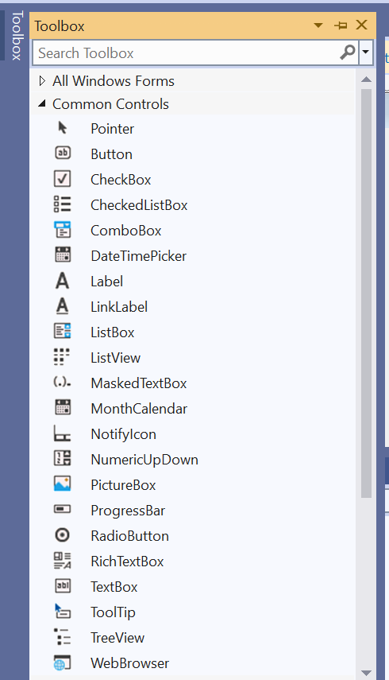
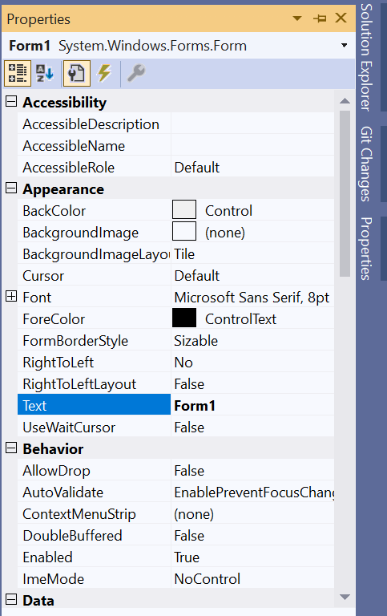
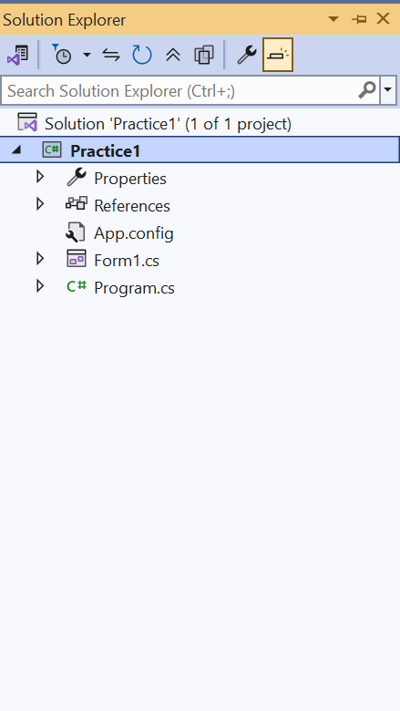

# Week One Screenshots

## 1. Visual Studio Environment

**What it is:** The Visual Studio development environment.

**What it is used for:** It is used to develop Visual C# applications.

## 2. Toolbox

**What it is:** The Toolbox contains controls used in Windows Forms.

**What it is used for:** It is used to add controls such as Buttons, Labels, and TextBoxes to a form.

## 3. Properties Window

**What it is:** The Properties Window displays properties of the selected object.

**What it is used for:** It is used to view and change properties such as Name, Text, and Font.

## 4. Solution Explorer

**What it is:** Solution Explorer displays the projects and files in a solution.

**What it is used for:** It is used to manage the files and projects in an application.

